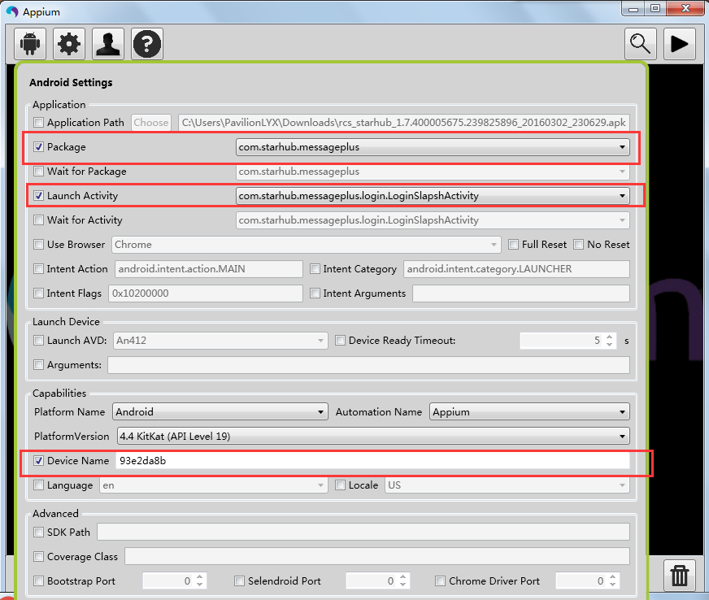

# 测试工程创建及维护人员
* GlobalRoam Chengdu R&D -- `QA Team: Lily Li`

# 关于测试工程
* 该工程是为`Message+`（也称成为RCS） 项目构建(环境请自行搜索安装)
* 该工程开发环境相关信息如下：
    * InteliJ IDEA 15 （IDE）
    * ANT
    * Maven
    * TestNG
    * ReportNG
    * Appium
    * Selenium2/Webdriver
    * JDK
    * Android SDK
    * Windows 7
* 项目存放在`Github`--[URL_GitLab](https://github.com/TesterCC/RCS_PageObject_AutoTest)
* 项目CI使用JENKINS，需要在`本机`或`服务器`搭建环境，方法请自行搜索学习(已实现分布式执行，具体配置参考远程服务器)
* 项目代码功能请见代码注释
* 该项目主要针对Message+ Android版本做自动化测试，使用pom.xml管理测试用例
* 此项目测试框架设计可在ios端自动化测试中复用，但需要在Mac电脑上配置相关环境

# 关于Appium的配置
* 该项目代码用Java编写，设计Appium启动部分代码如图，其他详细API请参考Appium官网：

```java
    //此部分代码设计Appium配置,GlobalSettings为保存全局变量的文件
    DesiredCapabilities capabilities = new DesiredCapabilities();

    capabilities.setCapability("deviceName", GlobalSettings.deviceName);
    capabilities.setCapability("udid", GlobalSettings.deviceUdid);
    capabilities.setCapability("platformName", GlobalSettings.platformName);
    capabilities.setCapability("platformVersion", GlobalSettings.platformVersion);
    capabilities.setCapability("appPackage", GlobalSettings.packageName);
    //这里写错Activity将导致App无法正常启动，请特别注意
    capabilities.setCapability("appActivity", GlobalSettings.launchactivityName);

    //这里初始化driver
    driver = new AndroidDriver<WebElement>(new URL(GlobalSettings.driverUrl), capabilities);
```

* 运行测试代码前需要启动本地安装的Appium Server客户端，Server客户端的配置如下图所示：
